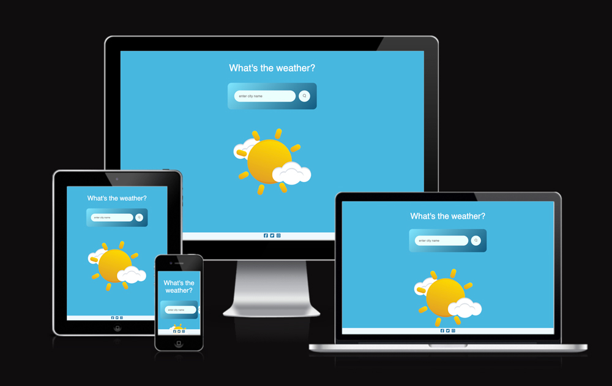

# What's the weather?

This is a weather app that helps users to check what the weather is like across the globe on a click of a button.

Find the live site [here]

[here]: https://flowercatgirl.github.io/secondAssignment/

---

## Features

- Checks the temperature of the place that user inputs and displays it in Celsius

- Gets Humidity and displays it

- Gets a Wind Speed and displays it

- Gets such weather conditions like: Clouds, Clear, Rain, Drizzle, Mist; and displays it via Weather Icons while changing the color of a background

- Gets Sunrise and Sunset times, then Local Time of the place, and using them calculates Daytime or Nighttime and reflects it by changing background color and Weather Icons

- Displays 404 icon when there's no such place found

- Discards special characters, that were entered by a mistake, also any white spaces before and after user input

- Have Social Icons within a footer

---

## Technologies Used

### Languages Used

- HTML5, CSS and Javascript

### Frameworks, Libraries & Programs Used

-  Git - For version control.

- Github - To save and store the files for the website.

- Font Awesome - For the iconography on the website.

- [Favicon.io](https://favicon.io/) To create favicon.

- [OpenWeather](https://openweathermap.org/api) API to fetch weather data.

- Google Dev Tools - To troubleshoot and test features, solve issues with responsiveness and styling.

- Photoshop - To create, cut and compress images.

- [Tinypng](https://tinypng.com/) To compress images.

- [Am I Responsive?](http://ami.responsivedesign.is/) To show the website image on a range of devices.

- Google Chrome extensions:
   Responsive Image Linter - To optimise image sizing.
   Better ruler - To check the size of a whitespace in the gallery in order to fill it.
   Lighthouse Report Viewer - to check the performance of the site.

